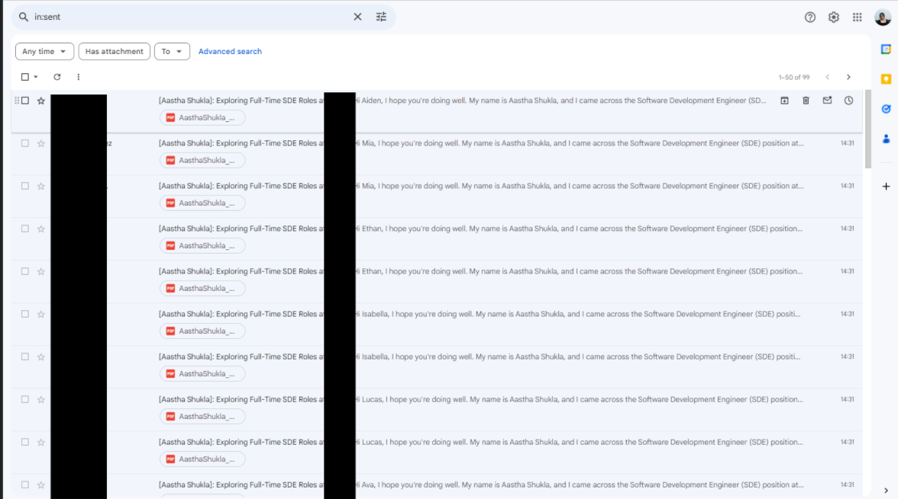
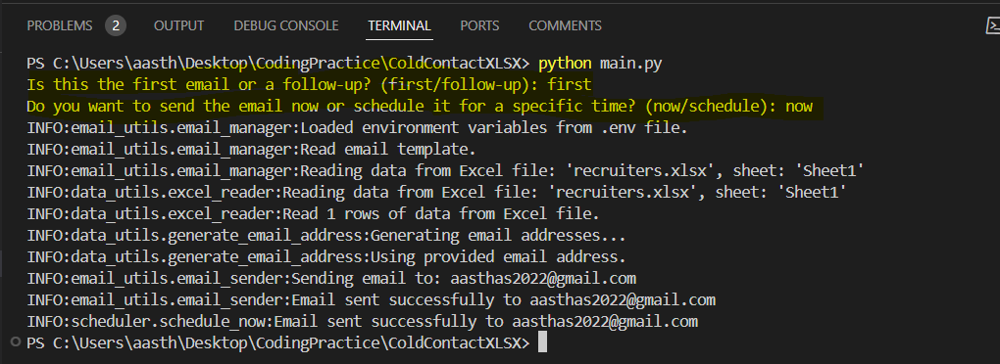
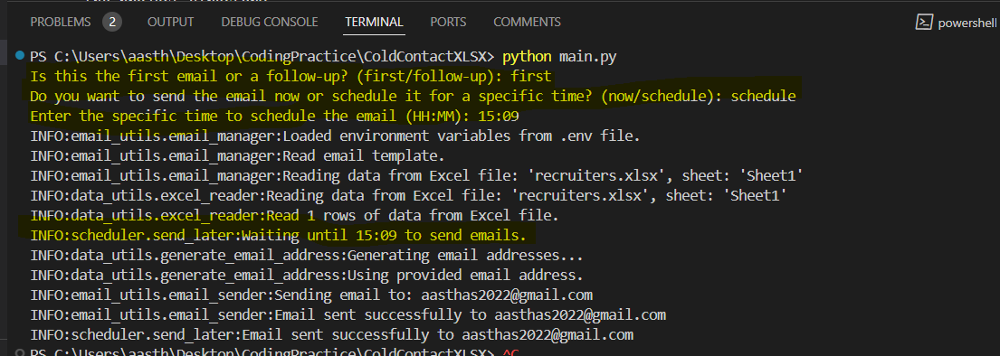

# ColdContactXLSX - Cold Email Automation for Job Seekers (Personalized)

## Overview

This project automates the process of sending cold emails from a job seeker (you) to recruiters. It utilizes common email address patterns to generate potential email addresses for recruiters based on their first name, last name, and company name. The goal is to save you time and effort by streamlining the process of reaching out to recruiters for potential job opportunities.

## How It Helped Me Save Time

As a job seeker, I used to spend over 3 hours every day sending cold emails to recruiters in various companies. However, this manual process was time-consuming and often led to fatigue and burnout. With the implementation of this cold email automation project:

- **Time Savings**: By automating the email sending process, I was able to significantly reduce the time spent on reaching out to recruiters. What used to take me hours to accomplish manually can now be done within minutes using this automated solution. For instance - once I had names of folks from a company, i was able to send over 50 emails in a few minutes.

    

- **Efficiency**: The project generates potential email addresses for recruiters based on common patterns, such as firstname@company.com, firstname.lastname@company.com, and firstnamelastname@company.com. This streamlined approach allows me to quickly send personalized cold emails to a large number of recruiters in less time.

- **Increased Productivity**: With the time saved from manual email sending, I can now allocate more time to other aspects of my job search, such as networking, skill development, and preparing for interviews. This increased productivity has helped me make significant progress in my job search journey.


## Features

- **Email Address Generation**: The project automatically generates potential email addresses for recruiters based on common patterns, saving you the hassle of manually guessing email addresses.

- **Personalized Cold Emails**: You can send personalized cold emails to recruiters using a predefined email template. The emails contain relevant information, such as your name, target company, designation and a customized message.

- **Attachment Support**: The project supports attaching files, such as resumes, to the cold emails, allowing you to provide additional information to recruiters.

- **Bulk Email Sending:** The project supports sending bulk emails to multiple recruiters simultaneously, allowing you to reach out to a large number of potential employers with minimal effort.

- **Scheduled Email Delivery**: Schedule email delivery for a specific time, allowing you to reach recipients at the most convenient time for them.

- **Batch Processing**: Emails are sent in batches, allowing for smoother processing and reducing the risk of errors or timeouts when sending a large number of emails.

- **Retry Logic**: In case of any errors encountered during email sending, the project includes a retry mechanism. It will attempt to resend the email for a maximum of 3 times before logging an error message if it fails.

- **Follow-Up Emails**: Send follow-up emails to recruiters who have not responded to your initial email, increasing your chances of getting a response.


## Usage

### Step 1: Prepare Data

1. **Open Excel Spreadsheet**: Open an Excel spreadsheet (e.g., Microsoft Excel, Google Sheets) on your computer.

2. **LinkedIn Search**: Visit LinkedIn (www.linkedin.com) and search for the recruiters or employees by company name. Often, you can find their profiles with their first and last names listed.

3. **Record Information**: Record the first name and last name of the recruiters or employees found on LinkedIn in your Excel spreadsheet. This will ensure that you have accurate data to use in the email generation process. In the spreadsheet, create columns for "First Name," "Last Name," "Email,", "Company Name" and "Desingation" Enter the relevant information for each recruiter or employee in the respective rows. If the recruiter or employee's email address is available, enter it in the "Email" column. If not, leave the "Email" column blank.

### Step 2: Update Resume File Name

1. **Locate Your Resume**: Find your resume file on your computer. Make sure it's in PDF format and is named appropriately (e.g., "YourName_Resume.pdf").

### Step 3: Update Environment Variables

1. **Create .env File**: Create a new text file on your computer and rename it to `.env` (make sure it doesn't have a `.txt` extension).

2. **Enter Email Credentials**: Open the `.env` file with a text editor (e.g., Notepad, TextEdit) and enter your email credentials in the following format:

   ```plaintext
   EMAIL_USERNAME=your_email@gmail.com
   EMAIL_PASSWORD=your_email_password
   ```

   Replace `your_email@gmail.com` with your email address and `your_email_password` with your email password.

### Step 4: Update Email Template File

1. **Choose Email Template**: Decide whether you want to use a formatted or plain text email template.

2. **Open Email Template File**: Locate the `email_template.txt` file in the project directory and open it with a text editor.

3. **Customize Email Content**: Modify the content of the email template to include a personalized message to recruiters or employees. You can include placeholders like `{first_name}`, `{last_name}`, `{company_name}`, and `{email}` to personalize each email.

   - If you want to send plain text emails, leave the formatting as is.
   - If you want to format your emails (e.g., bold, italics), uncomment the relevant lines in the template file and customize the formatting as desired.

### Step 5: Run the Script (send email now)

1. **Execute the Script**: Open a terminal or command prompt on your computer and navigate to the project directory.

2. **Run the Script**: Enter the command `python main.py` and press Enter to execute the script. Type in `first` and then `now` when prompted.

3. **Monitor Progress**: The script will start processing the data from the Excel spreadsheet, generating emails, and sending them to the recruiters or employees. You'll see progress messages in the terminal/command prompt indicating the status of each email being sent.

4. **Verify Sent Emails**: Once the script has finished running, check your email inbox to verify that the emails have been sent successfully.

   

### Step 6: Schedule Email Delivery

Note: I am aware that this is not ideal but ensure that the script remains running to execute scheduled tasks at the specified times without interruption.

1. **Execute the Script in Schedule Mode**: Open a terminal or command prompt on your computer and navigate to the project directory.

2. **Run the Script in Schedule Mode**: Enter the command `python main.py` and press Enter to execute the script. Type in `first` and then `schedule` when prompted.

3. **Choose Scheduled Delivery Option**: When prompted, type `schedule` to schedule the email for a specific time.

4. **Enter Scheduled Time**: Enter the specific time (in 24-hour format HH:MM) at which you want the emails to be sent.

5. **Monitor Progress**: The script will schedule the emails for delivery at the specified time. You'll see a confirmation message indicating that the emails have been scheduled.

6. **Verify Scheduled Emails**: You can verify the scheduled emails by checking the logs or by ensuring that the emails are sent at the specified time.

   

### Step 7: Send Follow-Up Emails

1. **Execute the Script (send follow-up email)**: Open a terminal or command prompt on your computer and navigate to the project directory.

2. **Run the Script (send follow-up email)**: Enter the command `python main.py` and press Enter to execute the script. When prompted type in `follow-up`

3. **Monitor Progress**: The script will start processing the data from the Excel spreadsheet, generating follow-up emails, and sending them to the recruiters or employees who have not responded to your initial email. You'll see progress messages in the terminal/command prompt indicating the status of each follow-up email being sent.

### Additional Tips

- **Review Email Drafts**: Before running the script, review the email drafts in the `email_template.txt` file to ensure they convey your message effectively.


## Dependencies

- Python 3.x
- `openpyxl` library for reading Excel files
- `smtplib` and `email` libraries for sending emails

## Configuration

Ensure that the following environment variables are set in the `.env` file:

```plaintext
EMAIL_USERNAME=<YourEmail@gmail.com>
EMAIL_PASSWORD=<YourEmailPassword>
```

## TODO

1. **Automate Data Capture:**
   - **Chrome Extension**: Develop a Chrome extension to automate the capture of recruiter and company details from LinkedIn profiles.
  
2. **Integration with OpenAI:**
   - **Dynamic Email Templates**: Integrate with OpenAI to dynamically generate personalized email templates for each recruiter based on their profile and company information.

3. **Streamline Process:**
   - **Eliminate Manual Entry**: Remove the need for manual data entry by seamlessly extracting information from LinkedIn profiles using the Chrome extension.

4. **Enhance User Experience:**
   - **Simplify Setup**: Provide a user-friendly setup process for integrating the Chrome extension with the ColdContactXLSX project.

5. **Maintain Data Privacy:**
   - **Ensure Compliance**: Ensure that the Chrome extension and data processing methods comply with privacy regulations to protect user and recruiter data.


## Contributing

Contributions are welcome! If you have any suggestions, feature requests, or bug reports, please open an issue or submit a pull request.
